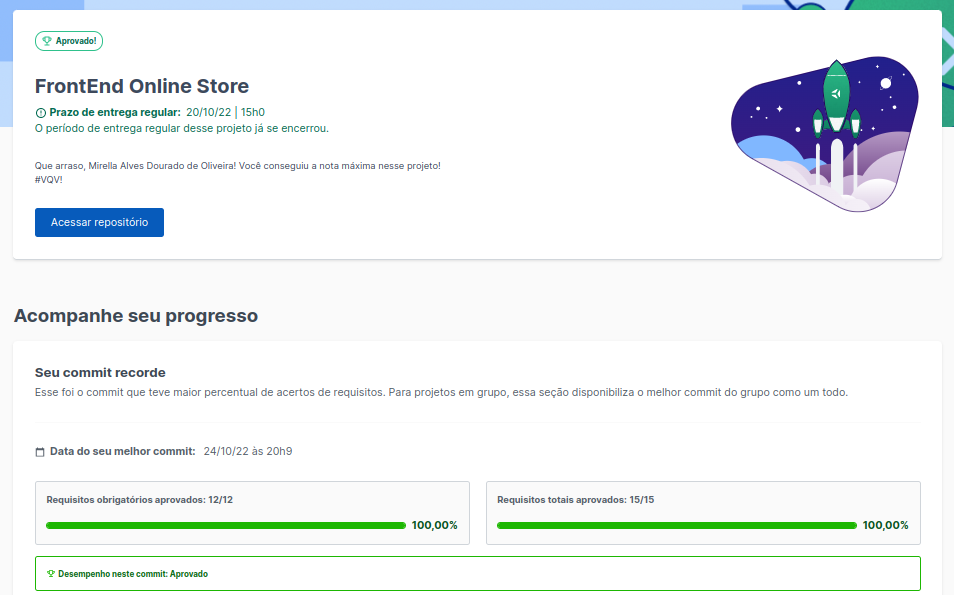
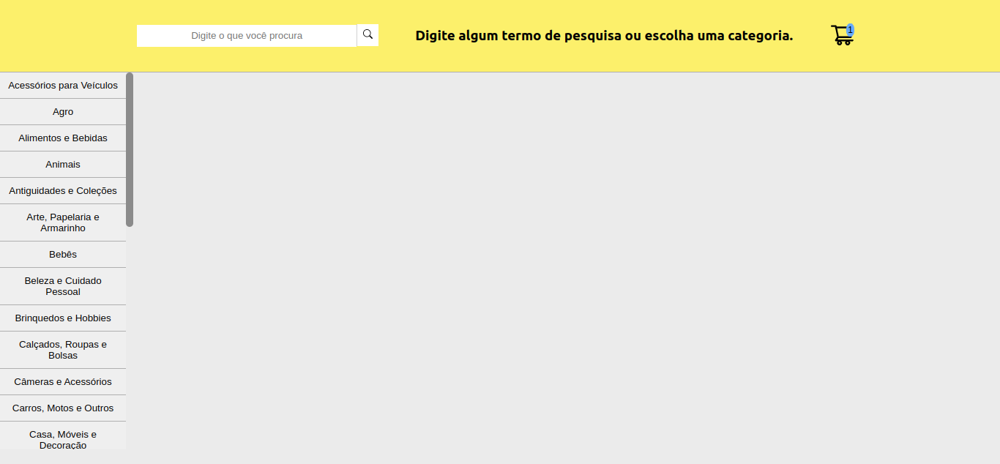
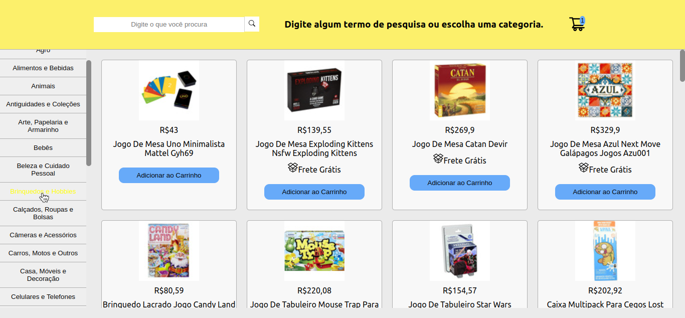
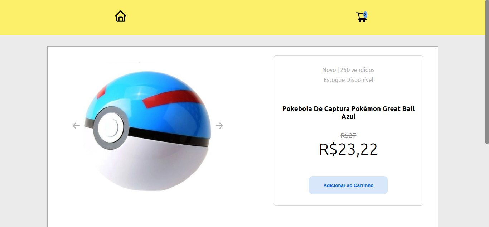
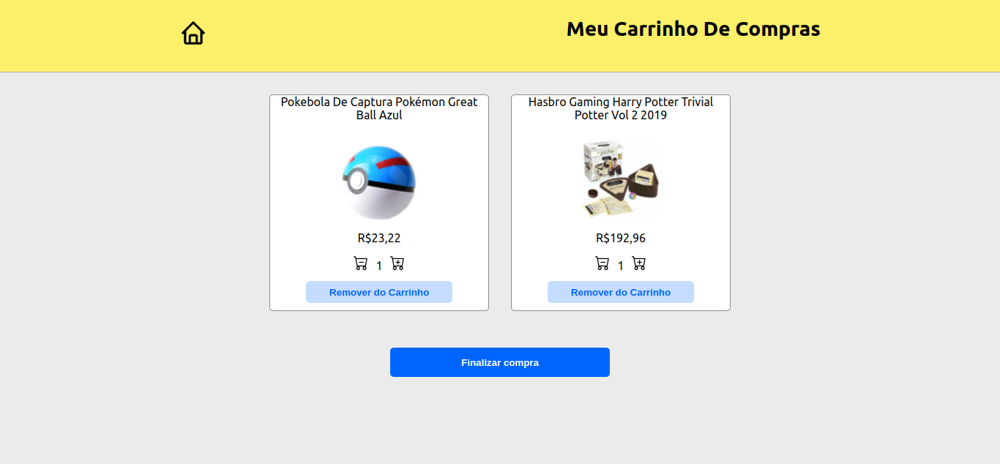
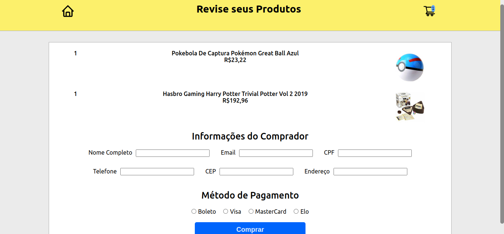

<h1> Welcome to my project FrontEnd Online Store! </h1>

<h2> About my project </h2>

 This is a project with MercadoLivre API. This simulates an online store, there you can search for itens by typing the name of it or looking by category, see the product details, rate the product, see your shopping cart and 'finalizing the purchase'!

Since this project was made in group the main focus is in agile methodologies and understand and application of knowledge about React based on Trybe's React teachings.

  
<strong>What is Trybe? 🤷🏽‍♀️</strong>
 

  Trybe is a web development school that is genuinely committed to the professional success of those who study with them. With the Shared Success Model (SSM) offered by Trybe Fintech, a financial institution authorized to operate by the Central Bank of Brazil, students have the option of paying only when they are already working.

<h2> Project Evaluation </h2> 

 On this project my grade was 100%. It means that i did correctly all the requirements in the proposed period. 

<h2> Project Preview </h2> 

<h2>Connect with me </h2>

 For more information you can contact me: 

